# Day 1 Solar System Geek Calculators (Pairs)
On the Solar System Geek home page there are links for three different calculation tools to "Explore the Solar System". Implement these calculators as specified below and modify the home page links to point to your implementations.

## Alien Weight Calculator
Given a weight on earth, this calculator should compute the equivalent weight on another planet in the solar system.  Use the [gravity of the alien planet](http://www.aerospaceweb.org/question/astronomy/q0227.shtml) compared to earth gravity to calculate the alien weight.
### Input

### Output
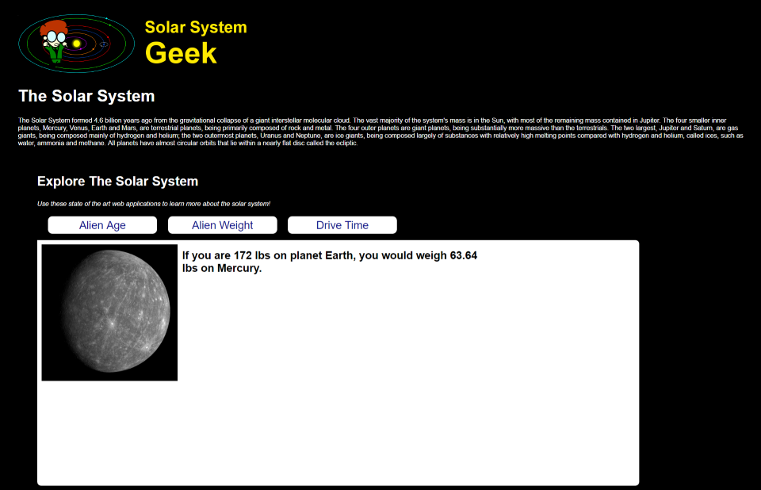

## Alien Age Calculator
Given an age in Earth years, this calculator should compute the equivalent age in [years for another planet in the solar system](http://www.enchantedlearning.com/subjects/astronomy/age.shtml).

### Input
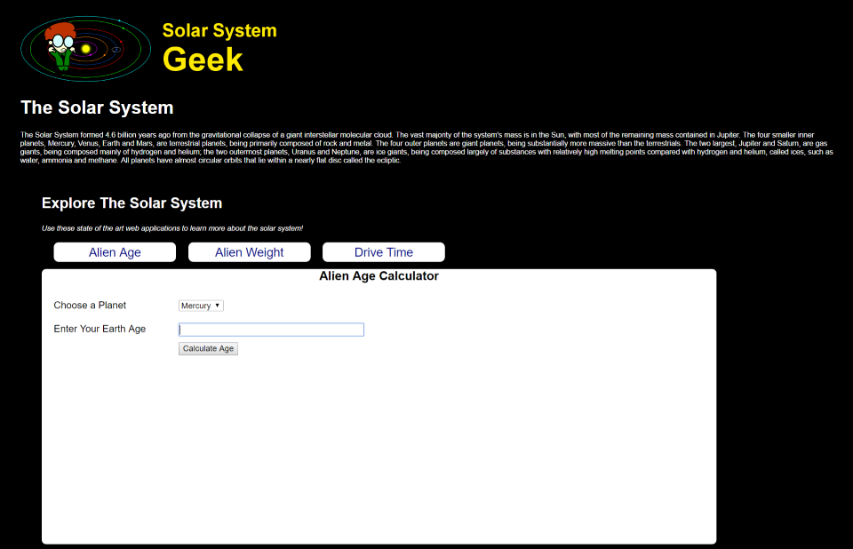
### Output
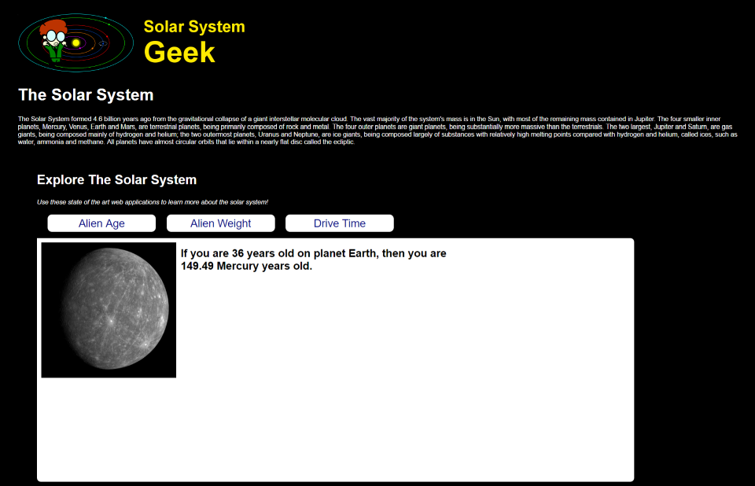

## Alien Travel Calculator
Given a destination planet, mode of transportation, and age of the traveler at the start of the journey, this calculator should compute the total travel time and age of the traveler upon arrival. The calculation should be based on the [average distance between planets in the solar system](http://theplanets.org/distances-between-planets/) and the following modes of transportation and their speeds:

- **Walking** (3mph)
- **Car** (100mph)
- **Bullet Train** (200mph)
- **Boeing 747** (570mph)
- **Concorde** (1350mph)

### Input
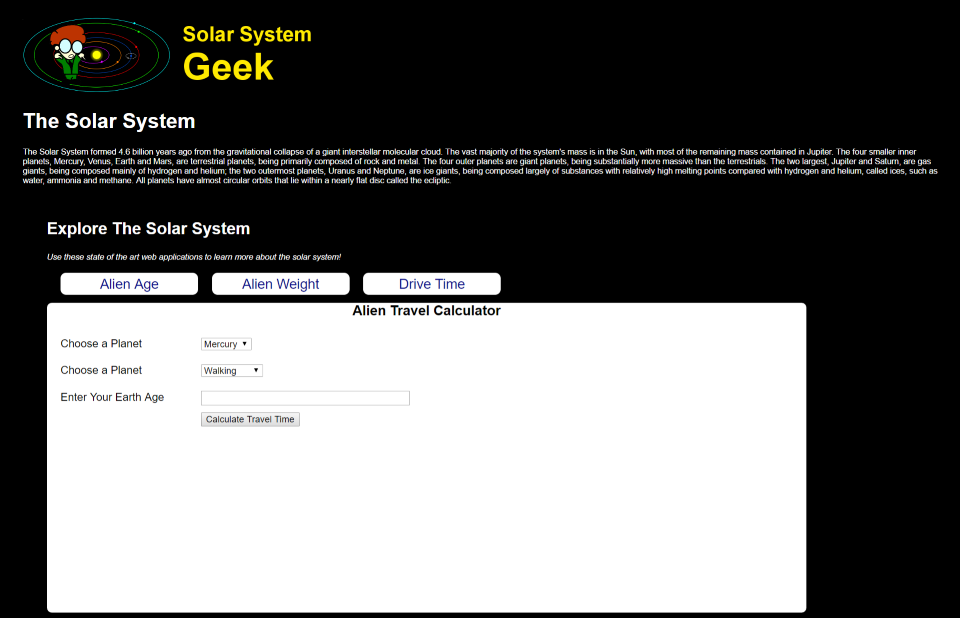
### Output
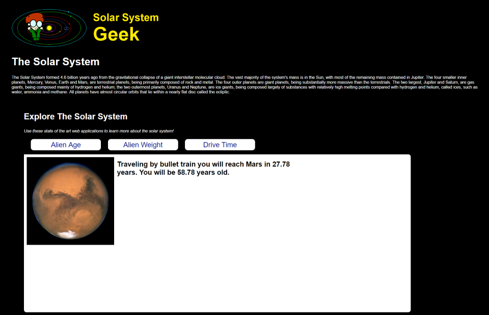

# Day 2 Solar System Geek Online Forum (Pairs)

You are developing an online bulletin board web component to SSGeek. Its a general forum posting, so anyone is welcome to join and post without needing to first login.

The application needs to support 2 core functionalities.
1. Provide a page that allows a site user to submit a new post to the bulletin board
2. View all posts on the bulletin board

**Your implementation must apply dependency injection and leverage a Test Double to ensure the controller logic is correct.**

**A database script, an interface, and a data access object has been provided. You will need to implement the details.**

## Submitting a New Post

Users can navigate to a page on the web application that provides them with a form to submit a new post for a bulletin board.

The page will provide the user with the form to submit:
* Username (required)
* Subject  (required)
* Message  (required)

## Viewing a Post

The View Posts page allows users the ability to see any posts that were previously submitted to the web application.

The page should display to the user all of the prior posts. You can use any type of layout that you prefer. 

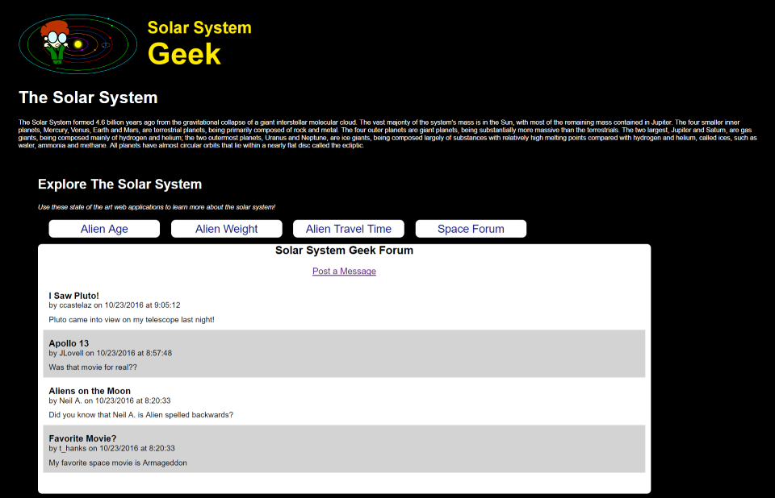

Any new posts that are submitted from the Submit Post page should show up on the View a Post page.

# Day 2 Bonus

Create a form that allows website visitors to sign up to win a prize.

Each visitor needs to provide their name, and answer a space trivia question.

Leverage HTTP POST and the Post-Redirect-Get pattern to
1. Show the user the form
2. Have the user post their answer
3. Redirect the user to the correct action based on the input

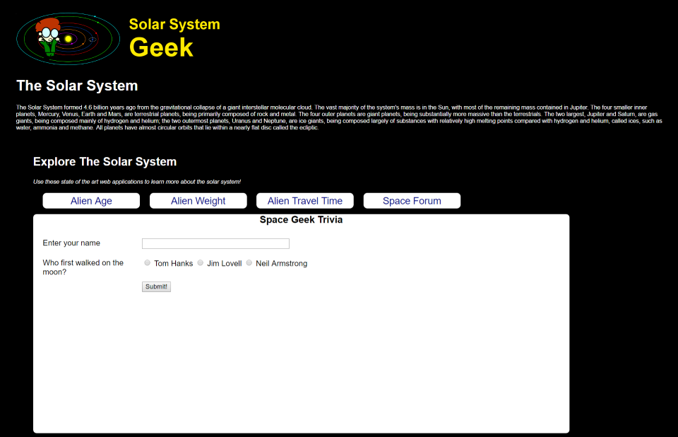

When the user answers it correctly, they see a Correct! page that confirms their answer.

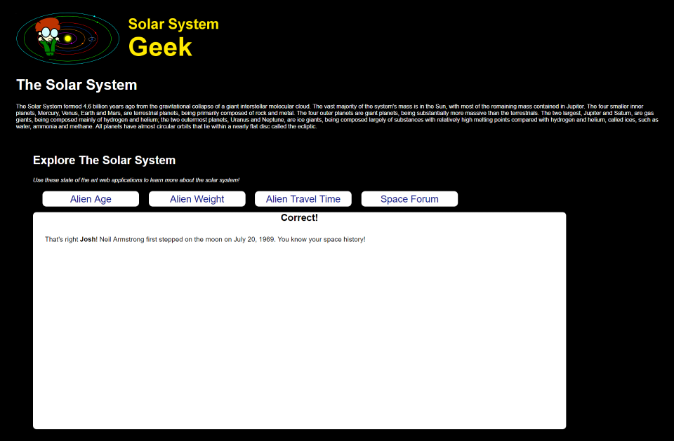

When the user answers incorrectly, they see an Incorrect! page telling them that they are incorrect.

# Day 3 Shopping Cart

You'll be creating a shopping cart that allows your website visitor the ability to view products, select a product and add a user-specified quantity to the shopping cart.

## Product List Page

The product listing page displays all of the inventory that the SSGeek shop contains.

**Requirements**

- When the user clicks on the image of a product they are navigated to the **Product Detail** page

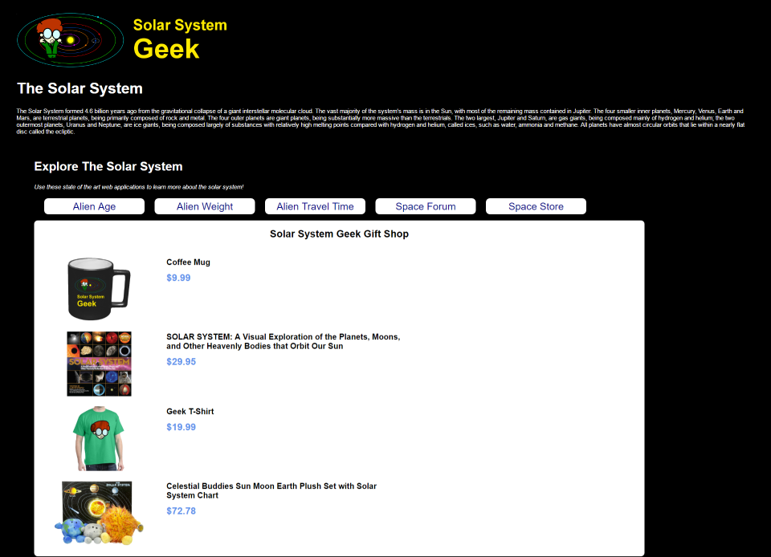

## Product Detail Page

The product detail page displays the data for a specific product and allows users to add products to their shopping cart.

**Requirements**

- When the user enters a quantity into the textbox and *presses Enter* or *presses Add to Cart* the product is added to their shopping cart
- After the user adds an item to their shopping cart, they are redirected to the View Cart page

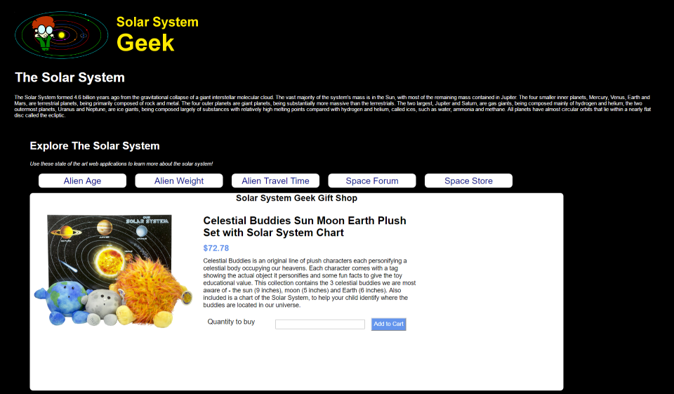

## View Shopping Cart

The View Shopping Cart page displays all of the items that are in the visitor's shopping cart to purchase.

**Requirements**

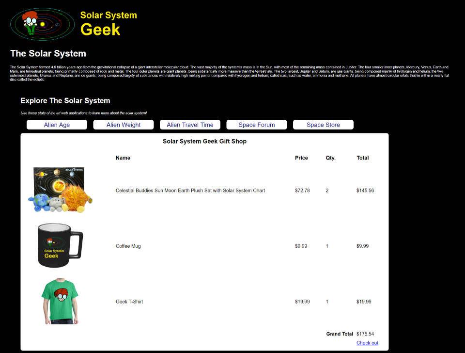

