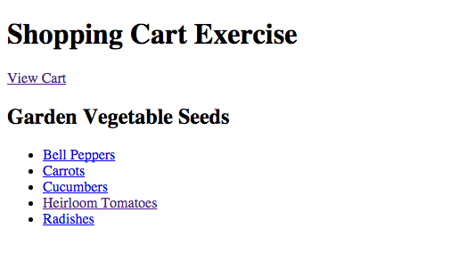
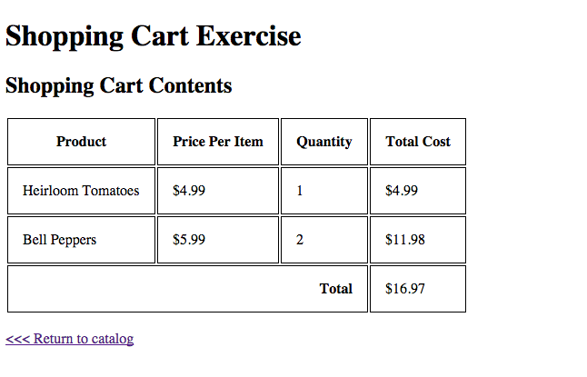
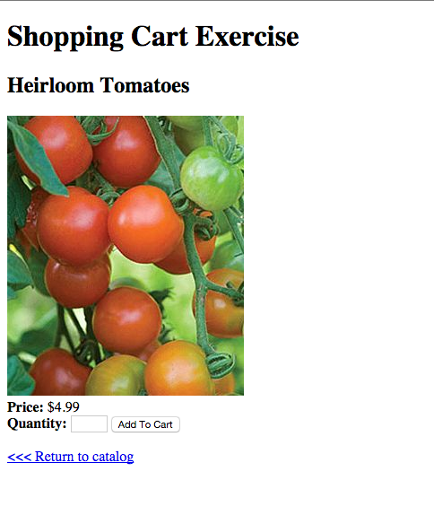

# Shopping Cart Exercise

During this exercise, you will need to implement a shopipng cart for an online seed store.

The application has 7 pages:

## Main Page

The main page of the site (**Seeds/Index**). This pagge displays a list of links to the various product pages.

For instance, if you click on Radishes, you will see the product page for radishes.  The main page also has a link to view the current contents of the shopping cart.  

## Shopping Cart Page

The shopping cart page shows the current content of the shopping cart.  It also shows a link to return to the seed catalog.

## Product Page

There is one product page for each of the 5 different seed types.  Each product page displays a picture of the product and provides a form that allows the user to add the product to the shopping cart.  
If the user clicks "Add to cart", the product is added to the cart and the user is returned to the seed catalog page.

# Hints

* You should start by designing and implementing an object model for your shopping cart.  This is a good opportunity to practice TDD.

* You'll need an object model for your product page too.

* Use the Session object to store your shopping cart
